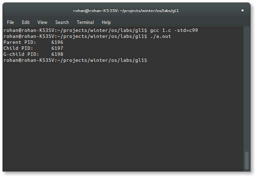
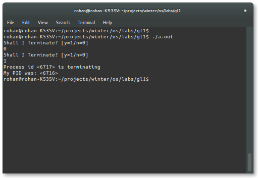
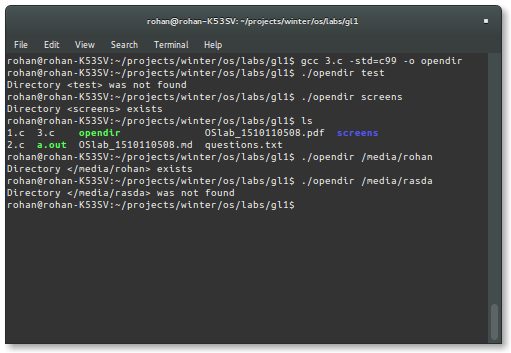

#CSD204 Operating Systems
###Dept of Computer Science and Engineering
###Shiv Nadar University
###First Graded Lab on 8-Mar-16

---

###1. Write a program  which when executed creates 3 processes out of which one is children and one is grandchild process? Print the process-id of each of the processes[5]



```c
/*
1. Write a program  which when executed creates 
3 processes out of which one is children and one 
is grandchild process? Print the process-id of each 
of the processes[5]
*/
#include <sys/types.h>
#include <stdio.h>
#include <stdlib.h>
#include <unistd.h>

int main(){

    pid_t p1, p2, p3;
    
    p1 = fork();

    
    if(p1 > 0){ // parent process
        printf("Parent PID: \t%d\n", getpid());
    }
    else if(p1 == 0){ //child process

        pid_t p2 = fork();

        if(p2 > 0){ // child process
            printf("Child PID: \t%d\n", getpid());
        }
        else if(p2 == 0){ //grandchild process
            printf("G-child PID: \t%d\n", getpid());
        }

    }


    return 0;
}
```

###2. Write a program or shellscript which creates one child and waits until this child terminates. Child should prompt the user by printing "Shall I terminate?" on STDOUT. Once the user enters, YES, it should terminate. After child terminates, the parent prints "Process id <pid> is terminating" on STDOUT and after that it terminates. [10]



```c
/*
2. Write a program or shellscript which creates one child and 
waits until this child terminates. 
Child should prompt the user by printing "Shall I terminate?" 
on STDOUT. Once the user enters, YES, it should terminate. 
After child terminates, the parent prints "Process id <pid> is terminating" 
on STDOUT and after that it terminates. [10]
*/

/* Skeleton Code Problem 2 */
#include <stdio.h>
#include <sys/wait.h>
#include <sys/types.h>
#include <stdlib.h>
#include <unistd.h>
#include <string.h>

int main(int argc, char *argv[]){
    pid_t pid;
    int choice;
    int status;
   //Do a man fork on bash prompt
   //create child process, check pid returned by the fork to decide parent/child
   //Write appropriate printf. 

    pid = fork();

    if(pid < 0){
        printf("Error in fork()\n");
    }
    else if(pid == 0){ // child process
        
        do {
            printf("%s\n", "Shall I Terminate? [y=1/n=0] ");
            scanf("%d", &choice);
            
        }while(choice != 1);
        
    }
    else if(pid > 0){ // parent process
        wait(&status);
        printf("Process id <%d> is terminating\n", pid);
        printf("My PID was: <%d>\n", getpid());
    }

    return 0; 
}
```

###3. Write a program that emulates shell command "opendir" command. [5]



```c
#include <stdio.h>
#include <sys/wait.h>
#include <sys/types.h>
#include <stdlib.h>
#include <unistd.h>
#include <string.h>

#include <dirent.h>

//DIR *opendir(const char *name);

int main(int argc, char *argv[]){

    if(argc == 2){

        if(opendir(argv[1]) == NULL)
            printf("Directory <%s> was not found\n", argv[1]);
        else{
            printf("Directory <%s> exists\n", argv[1]);
        }

    }
    else{
        printf("Usage: opendir <dir>\n");
    }

    return 0;
}
```

